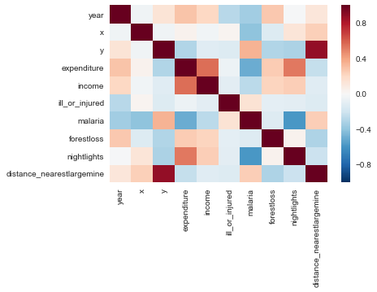
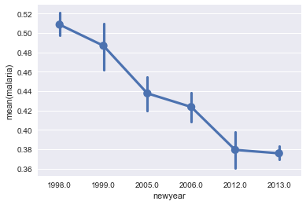
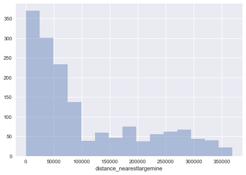

# Illegal Mines in Ghana

This repository is part of a hackfest we conducted in collaboration with the Royal Holloway - University of London on illegal small scale mines in Ghana.
Illegal small-scale mining is a growing industry in many African, Asian and Latin American developing countries. Gold and other precious minerals are extracted in a low-tech, labour-intensive process linked to environmental damages, health hazards and social ills. Additionally, the process provides huge employment and income potential in poverty-stricken communities. Since these small mining operations are mostly illegal, there is virtually no data to analyse their exact impact. This project seeks to fill this void to enable better-informed policy decisions by relevant stakeholders.

This repository contains Jupyter notebooks in an attempt to investigate the impact of previously detected small scale mines on surrounding environments and populations.
The data correlations are based on datasets containing household income, lighting levels and deforestation.

The set contains following projects:

* [**MainGLSS.ipynb**](MainGLSS.ipynb): This notebook is the main data analysis part for the combined data set of income lighting and deforestation.

* [**ChildHealth.ipynb**](ChildHealth.ipynb): This notebook was started to analyze the child health data set of Ghana. We did not continue on that due to the uncertainty of the reliability and the unexact locations due to privacy concerns.

* [**IDEAR.ipynb**](IDEAR/IDEAR.ipynb): This was using the IDEAR tool that already gives overview metrics for a given dataset. The yaml files describe the different datasets we use. We stopped using it because we encountered on a error in the code. [More Info on how to install and use this tool](https://github.com/Azure/Azure-TDSP-Utilities/blob/master/DataScienceUtilities/DataReport-Utils/Python/readme.md).

* [**TargetedFeatures.ipynb**](TargetedFeatures.ipynb): A notebook in which we start with a more constrained dataset where we know the meaning of all columns and we suspect correlation towards small-scale mining activities. It goes through the stages of data cleaning, exploration/visualisation and prediction using simple linear regression.

* [**HypothesisDriven.ipynb**](HypothesisDriven.ipynb): Here, we constrain the dataset even further based on the hypthosis that the majority of the mine workers are young, male and uneducated.

## Visualisations in _TargetedFeatures.ipynb_

### Correlation Matrix
The data set contains few relevant features: income, lighting, deforestation, health and distance

### One Hypothesis: Number of illness and malaria cases decreases with progressing year
Point plot of malaria cases over time:

### Distribution of distance measurements to the nearest large scale mine within the data set

#### Pairwise relationship between mines and number of malaria cases
[Scatter Plot: mines and malaria](visualisations/scatter-plot-malaria-minges.png)